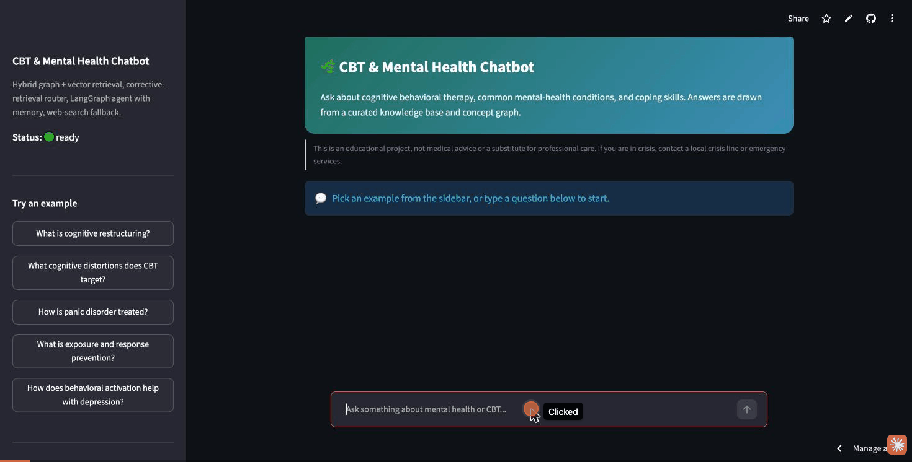

# mental-health-chatbot

A CBT / mental-health question-answering agent with **hybrid retrieval** (a Neo4j
knowledge graph + a Pinecone vector store), a **corrective-retrieval router**, a
**LangGraph agent** with conversation memory, and a **live web-search fallback**
that vets, chunks, and ingests new sources on the fly.

**Live app:** https://mental-health-chatbot-dimitri.streamlit.app · **API:** https://backend-production-63da.up.railway.app

> Personal learning project. Not medical advice.



*Knowledge-base answer → memory follow-up ("how is **it** used for OCD") → knowledge-graph answer → safety gate.*

## How it works

```
question
  │
  ├─ safety gate ─────────────────────► LLM crisis classifier; returns a crisis
  │                                     response and stops if risk is high
  ▼
condense ──► rewrite into a standalone question using chat history
  ▼
plan ──────► split into 1–3 sub-questions
  ▼
retrieve ──► per sub-question, the router:
  │            1. classifies path: graph_rag / naive_rag / both, extracts an entity
  │            2. retrieves (graph traversal and/or vector search)
  │            3. grades relevance; if weak, tries the other path
  │            4. still weak → web_search_and_ingest: search → worthiness check →
  │               semantic chunk → embed into Pinecone → use the text this turn
  │            5. nothing works → "no_answer" (synthesizer says it doesn't know)
  ▼
synthesize ► answer from retrieved context only; refuses to guess
```

- **Graph** (`src/retrieval.py`): relation-tiered traversal — specific facts
  (contraindication, has_symptom, exhibits, reflects…) ranked above vague
  disease links above plain hierarchy; round-robin diversify so one relation
  can't crowd out the rest.
- **Vector store**: `voyage-3.5` embeddings, contextual `[title — section]`
  prefix on every chunk, counsel-chat Q&A kept whole, long docs semantically
  chunked.
- **Memory**: LangGraph checkpointer over Postgres (`DATABASE_URL`), keyed by
  `thread_id`.

## Layout

```
src/                 runtime package (agent, router, planner, retrieval,
                     grading, safety, web_search_fallback)
backend/backend.py   FastAPI: POST /chat, GET /health
frontend/frontend.py Streamlit chat UI
data_prep/           one-off build scripts (chunk, embed, load graph)
data/                source datasets + generated artifacts — NOT in the repo,
                     rebuild with data_prep/ (see below)
eval/                golden_eval_set.json  (+ evaluate.py at repo root)
docs/                BUILD_GUIDE.md, FIXES.md
Dockerfile           builds the backend image (backend deps only)
```

## Setup

```bash
cp .env.example .env          # fill in the keys
uv sync                       # or: pip install -r requirements.txt
```

Needs: Anthropic, Voyage, Pinecone, Tavily API keys; a Neo4j instance with APOC;
a Postgres database.

## Build the stores (one-time)

```bash
# run from the repo root
python -m data_prep.merge_authoritative_sources   # add curated CBT docs to the corpus
python -m data_prep.chunk_vector_sources          # chunk → data/processed/vector_chunks_final.json
python -m data_prep.build_vector_store            # embed → Pinecone
python -m data_prep.load_neo4j                    # filtered + canonicalized graph load, with indexes
```

The source data (`vector_source_merged.csv`, `data/raw/authoritative_cbt/docs.json`)
is kept local. `merge_authoritative_sources.py` expects `docs.json`; the base
CSV must be supplied separately.

## Run

```bash
uvicorn backend.backend:app --port 8000     # API  (POST /chat, GET /health)
streamlit run frontend/frontend.py          # chat UI  ->  http://localhost:8501
```

The Streamlit app reads `BACKEND_URL` (default `http://localhost:8000`).

Library use / eval:

```python
from src.agent import run_agent
run_agent("what is exposure and response prevention?", thread_id="demo")
run_agent("what about for OCD specifically?", thread_id="demo")   # uses conversation memory
```

```bash
python evaluate.py    # scores routing + answers against the golden set (slow, many API calls)
```

## Deployment

- **Backend** → Railway (`Dockerfile`, backend deps only) + Railway Postgres.
  `railway.toml` sets the Docker builder, a `/health` check, and `watchPatterns`
  so only backend-relevant pushes rebuild. Auto-deploys from `main`.
- **Frontend** → Streamlit Community Cloud (`frontend/frontend.py`,
  `frontend/requirements.txt`). `BACKEND_URL` is set in the app's Secrets.
  Auto-deploys from `main`.

First-time setup:

```bash
railway init
railway add --database postgres           # injects DATABASE_URL
# set ANTHROPIC_API_KEY, VOYAGE_API_KEY, PINECONE_API_KEY, NEO4J_URI,
# NEO4J_USERNAME, NEO4J_PASSWORD, NEO4J_DATABASE, TAVILY_API_KEY on the service
railway up && railway domain
railway service source connect --repo <owner>/<repo> --branch main --service backend
# then set ALLOWED_ORIGINS to the deployed Streamlit URL
```

## Status

Deployed and working end-to-end: safety gate, condense/plan/retrieve/synthesize
agent, corrective router, graph + vector retrieval, web fallback, Postgres
memory, FastAPI backend, Streamlit chat UI, eval harness.
